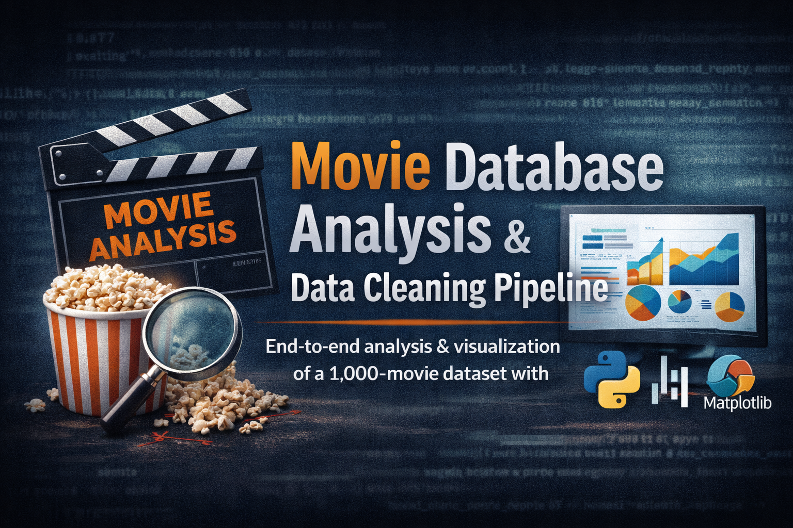

# Movie Database Analysis & Data Cleaning Pipeline

 

## Project Overview
This project provides a **complete end-to-end data science workflow** on a movie dataset containing 1,000 entries. The goal was to transform raw, unformatted data into a **structured analytical report** with professional visualizations. Key steps included **data cleaning, advanced imputation, statistical analysis**, and automated reporting to support data-driven insights on movie trends.

The analysis focused on trends in **revenue, ratings, and duration** across genres while handling data quality issues such as misaligned headers, incorrect data types, and missing values.

## Key Skills Demonstrated
- Data Cleaning & Structural Correction  
- Missing Data Imputation (Median by Genre)  
- Data Aggregation & Statistical Summaries  
- Automated Visual Reporting (PDF output)  
- Exploratory Data Analysis & Trend Identification  
- Python Programming with **Pandas**, **NumPy**, **Matplotlib**, and **Seaborn**

## Investigation Steps
1. **Data Ingestion & Correction**  
   - Loaded raw tab-separated(txt) data  
   - Corrected headers misplaced in the last row  

2. **Missing Data Handling**  
   - Dropped 100 records missing critical ratings  
   - Imputed revenue using genre-specific medians (Horror, Drama, Sci-Fi)  
   - Labeled 46 missing genres as "Unknown"  

3. **Aggregation & Reporting**  
   - Created a `Final_Data_Report` with mean ratings, average durations, and revenue stats per genre  
   - Compiled four visualizations into a multipage PDF for stakeholders  

## Key Insights
- **Revenue:** Action dominates with **30.35% market share** ($32,242.54M)  
- **Ratings:** Romance leads with an average rating of **5.69**, Horror lowest at **5.34**  
- **Duration:** Average movie length is **105.18 minutes**, debunking the "90-minute standard"  
- **Correlation:** Regression analysis shows **no strong link** between rating and revenue  

## Skills Applied
- Python, Pandas, NumPy  
- Matplotlib & Seaborn  
- PDF Export via Matplotlib `PdfPages`  

## Visualizations
1. **Movie Duration Distribution** – Histogram showing the cluster around 100–110 minutes  
2. **Rating vs Revenue** – Regression plot highlighting financial spread across ratings  
3. **Top Genres by Duration** – Bar chart showing longest average durations per genre  
4. **Revenue Market Share** – Donut chart illustrating Action movies’ dominance  

